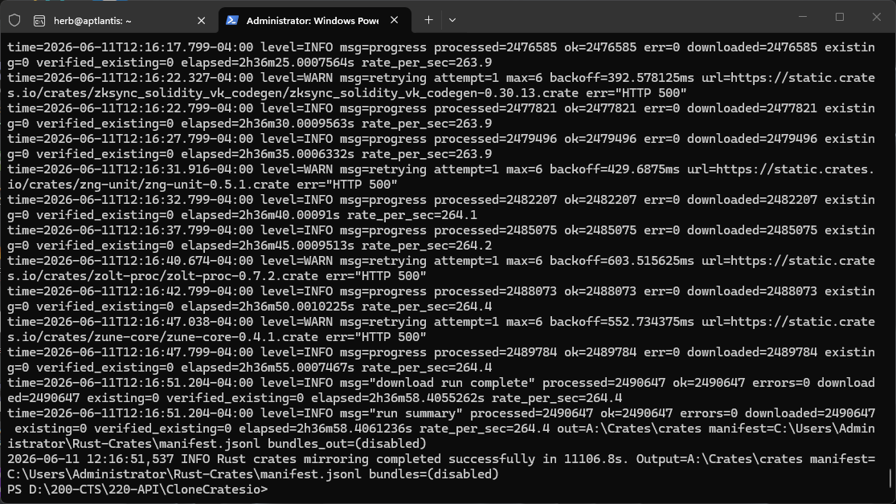
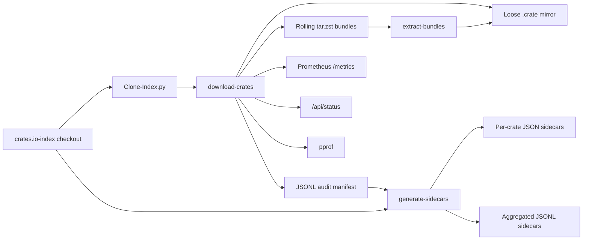

# CloneCratesio


CloneCratesio is a production-grade crates.io mirror pipeline built for large Rust ecosystem captures, offline development, archival work, and metadata analysis. It expands a local `crates.io-index` checkout into downloaded `.crate` artifacts, optional rolling `tar.zst` bundles, JSONL manifests, and sidecar metadata while exposing live operational telemetry through Prometheus and pprof.

The project has proven itself at full registry scale: on June 11, 2026, it mirrored 2,490,647 crate records with 2,490,647 successes, 0 errors, and a sustained rate of roughly 264 records per second.



Quick links: [Architecture](docs/Architecture.md) | [Windows Quickstart](docs/Quickstart-Windows.md) | [Prometheus](docs/Prometheus.md) | [Airgap Guide](docs/Airgap-Guide.md) | [Release v1.1.0](docs/RELEASE-v1.1.0.md)

---

## What This Project Covers

| Area | Summary |
|------|---------|
| Crates.io mirroring | Downloads crate archives from `static.crates.io` using entries from a local `crates.io-index` checkout. |
| Full-registry operation | Designed for millions of crate records, high concurrency, retries, progress logging, and restart-friendly update runs. |
| Integrity | Uses index checksum hints when available, supports explicit verification of existing files, and writes per-record audit output. |
| Storage models | Supports loose `.crate` files and rolling `tar.zst` bundle archives. |
| Bundle recovery | Can extract bundle archives back into the normal crates.io shard layout. |
| Metadata | Generates sidecar metadata as per-crate JSON files or aggregated JSONL for bundle workflows. |
| Observability | Exposes `/metrics`, `/api/status`, and `/debug/pprof/` on a configurable listener. |
| Airgap support | Produces portable mirror artifacts suitable for offline Rust development and ecosystem analysis. |

---

## Current Release

Current documented release: `v1.1.0`, published April 11, 2026.

This release corrected the day-to-day operator workflow:

- Default downloader concurrency is `128`.
- Existing crate files are trusted during routine update runs.
- `-verify-existing` is now an explicit integrity sweep.
- Bundle mode defaults to `only`, so bundle-first runs do not silently keep a second loose-file copy.
- Bundles preserve the crates.io shard layout internally.
- Bundled runs emit per-bundle manifests and a top-level `bundles.index.jsonl`.
- Sidecars now match the selected storage mode: adjacent JSON files for loose mirrors, aggregated JSONL for bundle mirrors.
- Prometheus and pprof start on `:9090` by default unless disabled.

See [Docs/RELEASE-v1.1.0.md](docs/RELEASE-v1.1.0.md) for the full release note.

---

## Project Identity

| Field | Value |
|-------|-------|
| Project name | CloneCratesio |
| Go module | `github.com/APTlantis/Mirror-Rust-Crates` |
| Primary implementation | Go CLIs with a Python orchestration wrapper |
| Current release | `v1.1.0` |
| Go version | `1.25` |
| Core dependencies | `github.com/klauspost/compress`, `github.com/prometheus/client_golang` |
| Primary artifact types | `.crate`, `.tar.zst`, `.jsonl`, `.crate.json` |

---

## Verified Full Mirror Run

The screenshot above records a completed full mirror run from June 11, 2026.

| Metric | Value |
|--------|-------|
| Processed records | `2,490,647` |
| Successful records | `2,490,647` |
| Errors | `0` |
| Downloaded records | `2,490,647` |
| Existing records | `0` |
| Verified existing records | `0` |
| Downloader elapsed time | `2h36m58.405262s` |
| Observed processing rate | `264.4/sec` |
| Outer wrapper elapsed time | `11106.8s` |
| Result | Full crates.io mirror completed successfully |

The downloader reported the mirror itself at `2h36m58.405262s`. The outer wrapper also printed a final process-level completion line of `11106.8s`, which can include setup, orchestration, and surrounding process time depending on how the run was launched.

The run also shows transient upstream `HTTP 500` responses being retried without losing the job. That matters: a full registry mirror is not just a fast download loop. It must survive registry-side errors, network noise, and millions of individual decisions while preserving a trustworthy record of what happened.

---

## Architecture at a Glance



The design separates registry indexing, crate transfer, artifact storage, sidecar generation, and operational telemetry. Each piece can be run independently, which makes the system easier to resume, inspect, test, and adapt for offline or archival workflows.

---

## Repository Layout

```text
Clone-Index.py               Python wrapper: clone/update index and launch downloader
cmd/
  download-crates/           CLI: mirror crates as loose files or bundles
  extract-bundles/           CLI: restore bundle archives into shard layout
  generate-sidecars/         CLI: write sidecars as files or JSONL
internal/
  downloader/                Download, retry, bundle, manifest, and metrics engine
  sidecar/                   Sidecar generation library
Docs/                        Architecture, guides, screenshots, and release notes
Testdata/                    Synthetic fixtures used in unit tests
```

---

## Components

### `Clone-Index.py`

Python wrapper for the end-to-end mirror workflow.

- Clones or updates the local `crates.io-index`.
- Provides Windows-friendly defaults under `%USERPROFILE%\Rust-Crates`.
- Maps high-level workflow flags to the Go downloader.
- Supports non-interactive runs for scheduled or CI-style operation.
- Prints wrapper-level start and completion summaries.

Important wrapper flags:

| Flag | Purpose |
|------|---------|
| `--index-dir` | Local `crates.io-index` checkout. |
| `--output-dir` | Destination mirror directory. |
| `--threads` | Downloader concurrency. Defaults to `128`. |
| `--include-yanked` | Include yanked crate versions from the index. |
| `--verify-existing` | Re-hash existing crate files. |
| `--bundle` | Enable bundle workflow. |
| `--bundle-mode only|add` | Choose bundle storage behavior. Defaults to `only`. |
| `--manifest` | Downloader JSONL audit log path. |
| `--listen` | Metrics listener. Defaults to `:9090`. |
| `--skip-index-update` | Use the current local index without fetching. |
| `--non-interactive` | Run without prompts. |

### `cmd/download-crates`

Go downloader and primary work engine.

- Reads crate records from a local index or URL list.
- Builds `https://static.crates.io/crates/{name}/{name}-{version}.crate` URLs.
- Downloads concurrently using configurable worker count.
- Retries transient HTTP and network failures.
- Writes a JSONL audit manifest.
- Supports loose-file mirrors and rolling bundle archives.
- Exposes Prometheus, JSON status, and pprof endpoints.

Important flags:

| Flag | Purpose |
|------|---------|
| `-index-dir` | Local `crates.io-index` checkout. |
| `-out` | Destination for loose crate files or bundle staging. |
| `-concurrency` | Worker count. Defaults to `128`. |
| `-verify-existing` | Re-hash existing files instead of trusting them. |
| `-bundle` | Enable rolling bundle output. |
| `-bundle-mode only|add` | Remove loose files after bundling, or keep both copies. Defaults to `only`. |
| `-bundle-size-gb` | Target bundle size. Defaults to `8`. |
| `-bundles-out` | Directory for `.tar.zst` bundles and bundle manifests. |
| `-manifest` | JSONL audit log path. |
| `-listen` | Metrics listener. Defaults to `:9090`; pass an empty string to disable. |

### `cmd/generate-sidecars`

Metadata generation tool.

- Reads index entries and emits structured metadata.
- Writes per-crate `.crate.json` files for loose-file mirrors.
- Writes aggregated JSONL sidecars for bundle mirrors.
- Can enrich sidecars using downloader manifest data such as bundle path and bundle member.

Important flags:

| Flag | Purpose |
|------|---------|
| `-index-dir` | Local `crates.io-index` checkout. |
| `-out` | Loose mirror directory for file sidecars. |
| `-output-mode files|jsonl` | Choose adjacent files or one aggregated JSONL stream. Defaults to `files`. |
| `-jsonl-out` | Required output path for `-output-mode jsonl`. |
| `-manifest` | Optional downloader manifest used to enrich bundle metadata. |
| `-concurrency` | Worker count. Defaults to `128`. |
| `-include-yanked` | Include yanked crate versions. |

### `cmd/extract-bundles`

Bundle restoration tool.

- Reads `.tar.zst` bundle archives.
- Restores crate files into the normal crates.io shard layout.
- Preserves archive member paths exactly as written by the downloader.

Important flags:

| Flag | Purpose |
|------|---------|
| `-bundles-dir` | Directory containing bundle archives. |
| `-pattern` | Bundle glob. Defaults to `*.tar.zst`. |
| `-out` | Destination shard tree. |
| `-overwrite` | Replace existing files during extraction. |

---

## Storage Models

### Loose-file mirror

Loose-file mode stores each crate archive under the crates.io shard layout.

Examples:

| Crate | Stored path pattern |
|-------|---------------------|
| `serde` | `s/er/serde-<version>.crate` |
| `ab` | `ab/ab-<version>.crate` |
| `1serde` | `1/se/1serde-<version>.crate` |

Use this mode when direct per-crate access matters more than inode count.

### Bundle mirror

Bundle mode stores crate archives in rolling `tar.zst` archives.

- Default bundle behavior is `only`, which removes the loose `.crate` after it is added to the bundle.
- `add` mode keeps both the loose file and the bundled copy.
- Each bundle gets a per-bundle manifest.
- The run also produces a top-level `bundles.index.jsonl` catalog.

Use this mode when transportability, archive management, and lower filesystem pressure matter more than browsing individual crate files.

---

## Manifest and Audit Trail

The downloader manifest is a JSONL audit log. Each record can include:

- `schema_version`
- `url`
- `path`
- `storage`
- `bundle_path`
- `bundle_member`
- `size`
- `sha256`
- `started_at`
- `finished_at`
- `ok`
- `status`
- `retries`
- `error`

Common statuses:

| Status | Meaning |
|--------|---------|
| `downloaded` | File was downloaded and verified during this run. |
| `existing` | File already existed and was trusted for a routine update run. |
| `verified_existing` | File already existed and was re-hashed successfully. |
| `error` | Record failed after retry policy was exhausted. |

For large mirrors, this audit log is as important as the files themselves. It lets an operator prove what was attempted, what succeeded, what was skipped, and where any future repair run should focus.

---

## Observability

By default, the downloader listens on `:9090`.

| Endpoint | Purpose |
|----------|---------|
| `/metrics` | Prometheus scrape endpoint. |
| `/api/status` | Lightweight JSON status for scripts and dashboards. |
| `/debug/pprof/` | Go profiling endpoints for CPU, heap, goroutines, and traces. |

The status API reports:

- `processed`
- `ok`
- `errors`
- `downloaded`
- `existing`
- `verified_existing`
- `uptime_sec`
- `rate_per_sec`

Useful Prometheus metrics include:

- `crates_download_requests_total`
- `crates_download_bytes_total`
- `crates_download_duration_seconds`
- `crates_download_retries_total`
- `crates_download_inflight`
- `crates_processed_total`

See [Docs/Prometheus.md](docs/Prometheus.md) for metric definitions, PromQL examples, Grafana panel ideas, and alerting rules.

---

## Quick Start

### Prerequisites

- Go 1.25+ or the project-provided toolchain if available.
- Python 3.9+.
- Git.
- Fast local storage. NVMe is strongly recommended for full registry mirrors.

### Prepare directories

```powershell
$root = "$env:USERPROFILE\Rust-Crates"
New-Item -Force -ItemType Directory $root, "$root\crates.io-index", "$root\mirror" | Out-Null
```

### Clone the crates.io index

```powershell
git clone https://github.com/rust-lang/crates.io-index "$root\crates.io-index"
```

For later runs:

```powershell
git -C "$root\crates.io-index" fetch --prune --all
git -C "$root\crates.io-index" reset --hard origin/master
```

### Build the tools

```powershell
go build -o .\bin\download-crates.exe .\cmd\download-crates
go build -o .\bin\generate-sidecars.exe .\cmd\generate-sidecars
go build -o .\bin\extract-bundles.exe .\cmd\extract-bundles
```

### Dry-run preflight

```powershell
.\bin\download-crates.exe `
  -index-dir "$root\crates.io-index" `
  -out "$root\mirror" `
  -concurrency 128 `
  -dry-run `
  -log-level info
```

### Run a loose-file mirror

```powershell
.\bin\download-crates.exe `
  -index-dir "$root\crates.io-index" `
  -out "$root\mirror" `
  -concurrency 128 `
  -include-yanked `
  -progress-interval 5s `
  -listen :9090 `
  -log-format json
```

### Run through the Python wrapper

```powershell
python Clone-Index.py `
  --index-dir "$root\crates.io-index" `
  --output-dir "$root\mirror" `
  --threads 128 `
  --include-yanked `
  --non-interactive
```

### Generate sidecars

```powershell
.\bin\generate-sidecars.exe `
  -index-dir "$root\crates.io-index" `
  -out "$root\mirror" `
  -concurrency 128 `
  -progress-interval 5s
```

---

## Bundle Workflow

Bundle mode is the better fit when the mirror needs to be moved, archived, or kept on a filesystem where millions of loose files are painful.

```powershell
.\bin\download-crates.exe `
  -index-dir "$root\crates.io-index" `
  -out "$root\mirror-work" `
  -concurrency 128 `
  -include-yanked `
  -bundle `
  -bundle-mode only `
  -bundle-size-gb 8 `
  -bundles-out "$root\bundles" `
  -manifest "$root\manifest.jsonl" `
  -listen :9090 `
  -log-format json
```

Generate bundle-oriented sidecars:

```powershell
.\bin\generate-sidecars.exe `
  -index-dir "$root\crates.io-index" `
  -output-mode jsonl `
  -jsonl-out "$root\sidecars.jsonl" `
  -manifest "$root\manifest.jsonl" `
  -include-yanked
```

Extract bundles back to the shard layout:

```powershell
.\bin\extract-bundles.exe `
  -bundles-dir "$root\bundles" `
  -pattern "*.tar.zst" `
  -out "$root\restored-mirror"
```

---

## Recommended Workflows

| Workflow | Command pattern | Use when |
|----------|-----------------|----------|
| First loose-file mirror | `download-crates -index-dir ... -out ... -include-yanked` | You want a normal shard tree of `.crate` files. |
| Routine update | `download-crates -index-dir ... -out ...` | The mirror already exists and you want only new or changed records. |
| Integrity sweep | `download-crates -index-dir ... -out ... -verify-existing` | You want existing files re-hashed against index checksums. |
| Bundle-first mirror | `download-crates -bundle -bundle-mode only ...` | You want lower inode pressure and transport-friendly archives. |
| Bundle sidecars | `generate-sidecars -output-mode jsonl -manifest ...` | You want one metadata stream enriched with bundle paths. |
| Restore bundles | `extract-bundles -bundles-dir ... -out ...` | You need to recreate the loose shard tree from archives. |

Routine update runs are intentionally fast in v1.1.0: existing files are trusted unless `-verify-existing` is supplied. That makes normal syncs cheap while still keeping a deliberate verification path available.

---

## Operational Guidance

- Use `-dry-run` before expensive runs to validate paths and effective configuration.
- Use high concurrency only with fast storage and a reliable network path.
- Keep the JSONL manifest with the mirror artifacts; it is the repair map.
- Use `-verify-existing` for deliberate integrity sweeps, not every routine update.
- Keep Prometheus or the JSON status endpoint visible during full registry runs.
- Prefer bundle mode for archival transport and loose-file mode for direct file serving.
- Avoid network shares for active mirroring if throughput and consistency matter.

---

## Development

Build all Go packages:

```powershell
go build ./cmd/...
```

Run tests:

```powershell
go test ./...
```

Useful quality checks:

```powershell
gofmt -w .
go vet ./...
```

The automated coverage includes shard path helpers, checksum verification, update behavior, bundle mode behavior, bundle catalog generation, sidecar file mode, and sidecar JSONL mode with manifest enrichment.

---

## Documentation Map

| File | Purpose |
|------|---------|
| [Docs/Architecture.md](docs/Architecture.md) | Detailed pipeline architecture and data flow. |
| [Docs/Quickstart-Windows.md](docs/Quickstart-Windows.md) | Windows PowerShell quickstart. |
| [Docs/Prometheus.md](docs/Prometheus.md) | Metrics, status API, pprof, Grafana, and alerting. |
| [Docs/Airgap-Guide.md](docs/Airgap-Guide.md) | Offline and airgapped usage guidance. |
| [Docs/CloneCrates.io - Technical Q&A and Implementation Guide.md](docs/CloneCrates.io%20-%20Technical%20Q%26A%20and%20Implementation%20Guide.md) | Implementation-oriented Q&A. |
| [Docs/Maintainer-Retrospective-v1.1.0.md](docs/Maintainer-Retrospective-v1.1.0.md) | Maintainer notes and project history. |
| [Docs/RELEASE-v1.1.0.md](docs/RELEASE-v1.1.0.md) | Current release notes and upgrade guidance. |
| [CloneCratesio.manifest.toml](CloneCratesio.manifest.toml) | Machine-readable project manifest. |

---

## Release Posture

CloneCratesio is stable infrastructure. The project is not a toy crawler and not a one-off script; it is a resumable mirroring system with defined artifacts, status reporting, verification behavior, and operational documentation.

Current posture:

| Field | Value |
|-------|-------|
| Stage | Production |
| Completion | 100% |
| Stability | Stable |
| Technical debt | Low |
| Maintenance burden | Low |
| License | MIT |
| Maintainer | Herb |

---

## Core Principles

**The manifest is the memory of the run.**
Downloaded files matter, but the manifest explains how they got there.

**Retries are part of correctness.**
At registry scale, transient upstream errors are normal. The system is built to absorb them and continue.

**Storage is a policy choice.**
Loose files, bundles, and sidecars serve different operational needs. The pipeline supports each without changing the source of truth.

**Observability is not optional.**
Full-registry work is long-running infrastructure work. Operators need live counters, status APIs, and profiling hooks.

**Offline capability starts with reproducibility.**
An airgapped mirror is only valuable when it can be rebuilt, inspected, verified, and transported with confidence.

---

## License

MIT License. See [LICENSE](LICENSE) for details.

---

## Author

Maintained by Herb.

```html
<script type="application/ld+json">
{
  "@context": "https://schema.org",
  "@type": "SoftwareSourceCode",
  "name": "CloneCratesio",
  "description": "High-performance crates.io mirroring pipeline with resumable downloads, bundle archives, sidecar metadata, JSONL audit logs, and Prometheus observability.",
  "license": "https://opensource.org/licenses/MIT",
  "programmingLanguage": ["Go", "Python", "PowerShell"],
  "author": {
    "@type": "Person",
    "name": "Herb"
  }
}
</script>
```
